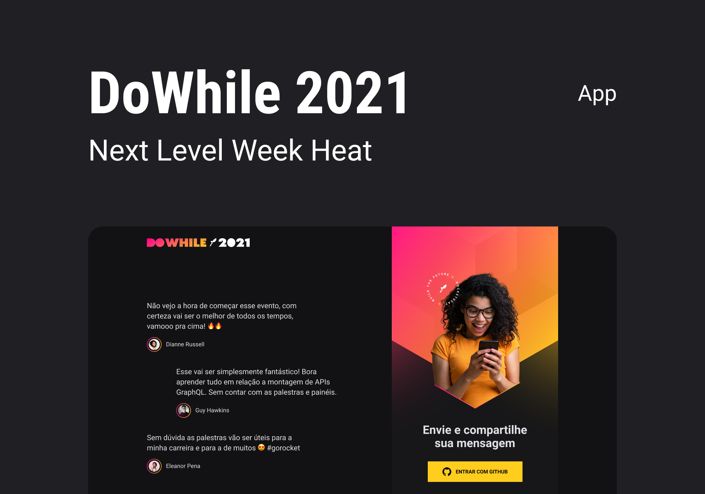

<div align="center">
  <br/>
  
</div>

## 💻 Sobre o projeto

Este é um projeto Full Stack desenvolvido durante o NLW Heat, um evento da plataforma **[Rocketseat](https://rocketseat.com.br/)**, a proposta do projeto é criar um sistema onde os usuários podem enviar mensagens expressando suas expectativas para o evento **[DoWhile 2021](https://dowhile.io/inscricao)**.

- **[Acesse o layout](https://www.figma.com/community/file/1031699316177416916)**



---

## 🛠️ Tecnologias utilizadas

#### Back-end:

- **[TypeScript](https://www.typescriptlang.org/)**
- **[Node.js](https://nodejs.dev/)**
- **[Express](https://expressjs.com/pt-br/)**
- **[Socket.io](https://socket.io/)**
- **[SQLite](https://www.sqlite.org/index.html)**
- **[Prisma](https://www.prisma.io/)**
- **[Axios](https://axios-http.com/docs/intro)**

#### Front-end:

- **[TypeScript](https://www.typescriptlang.org/)**
- **[React](https://pt-br.reactjs.org/)**
- **[Styled Components](https://styled-components.com/)**
- **[Axios](https://axios-http.com/docs/intro)**
- **[React Hot Toast](https://react-hot-toast.com/)**

#### Mobile:

- **[TypeScript](https://www.typescriptlang.org/)**
- **[React Native](https://reactnative.dev/)**
- **[Expo](https://expo.dev/)**
- **[Moti](https://moti.fyi/)**
- **[Axios](https://axios-http.com/docs/intro)**

#### Nuvem de Tags:

- **[Elixir](https://elixir-lang.org/)**
- **[Phoenix](https://www.phoenixframework.org/)**
- **[Ecto](https://hexdocs.pm/ecto/Ecto.html)**
- **[Quantum](https://hexdocs.pm/quantum/readme.html)**

---

## ⚙️ Executando o projeto

### Pré-requisitos

- **[GIT](https://git-scm.com/)**
- **[Node](https://nodejs.org/en/)**
- **[Yarn](https://classic.yarnpkg.com/en/docs/install/)**

**Clone o repositório**

```
git clone https://github.com/theandersonfonseca/nlw-heat.git
```

**Acesse a pasta do projeto**

```
cd nlw-heat
```

#### Executando a API:

```
# Acesse a pasta da API
cd server

# Instale as dependências
yarn

# Altere as variáveis de ambiente

# Execute as migrations
yarn prisma migrate dev

# Inicie a API
yarn dev
```

#### Executando o Front-end:

```
# Acesse a pasta do Front-end
cd web

# Instale as dependências
yarn

# Altere as variáveis de ambiente

# Inicie a aplicação
yarn dev
```

#### Executando o Mobile:

```
# Acesse a pasta do Mobile
cd mobile

# Instale as dependências
yarn

# Altere as variáveis de ambiente e coloque seu ip em src/services/api

# Inicie a aplicação
yarn start
```

---

Feito com 💜 por **[Anderson Fonseca](https://github.com/theandersonfonseca)**.
